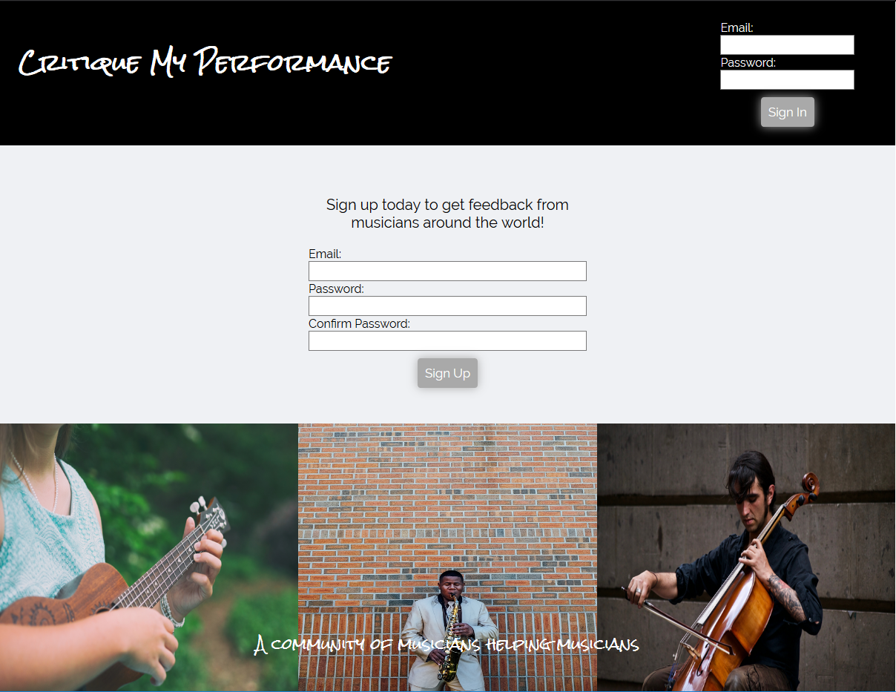
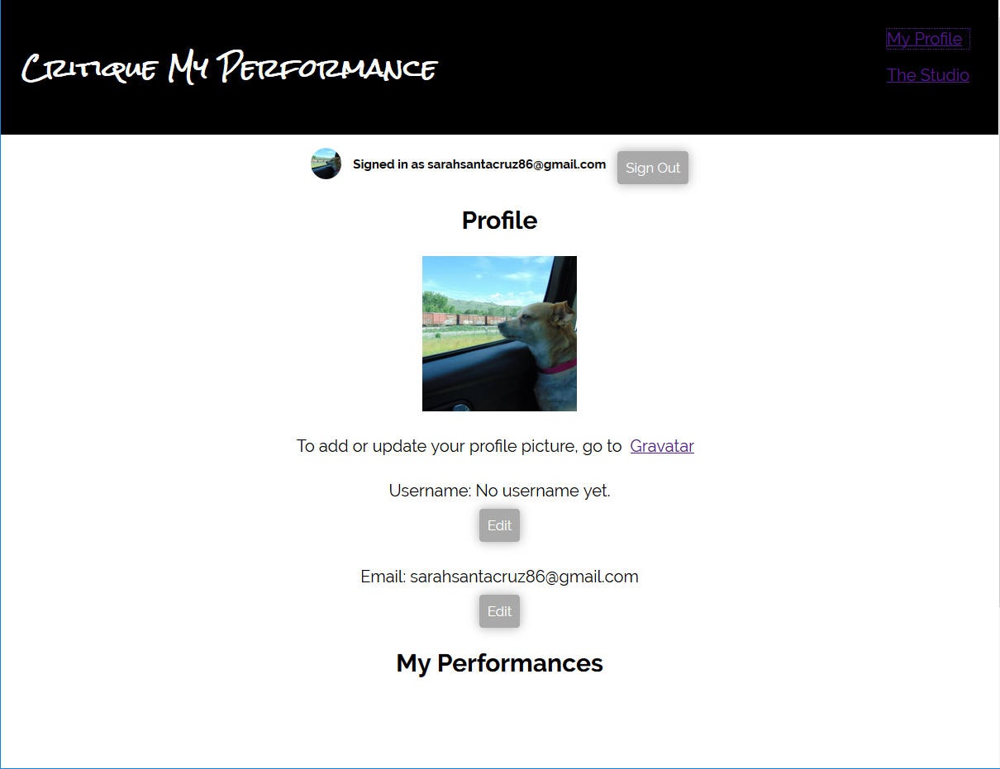
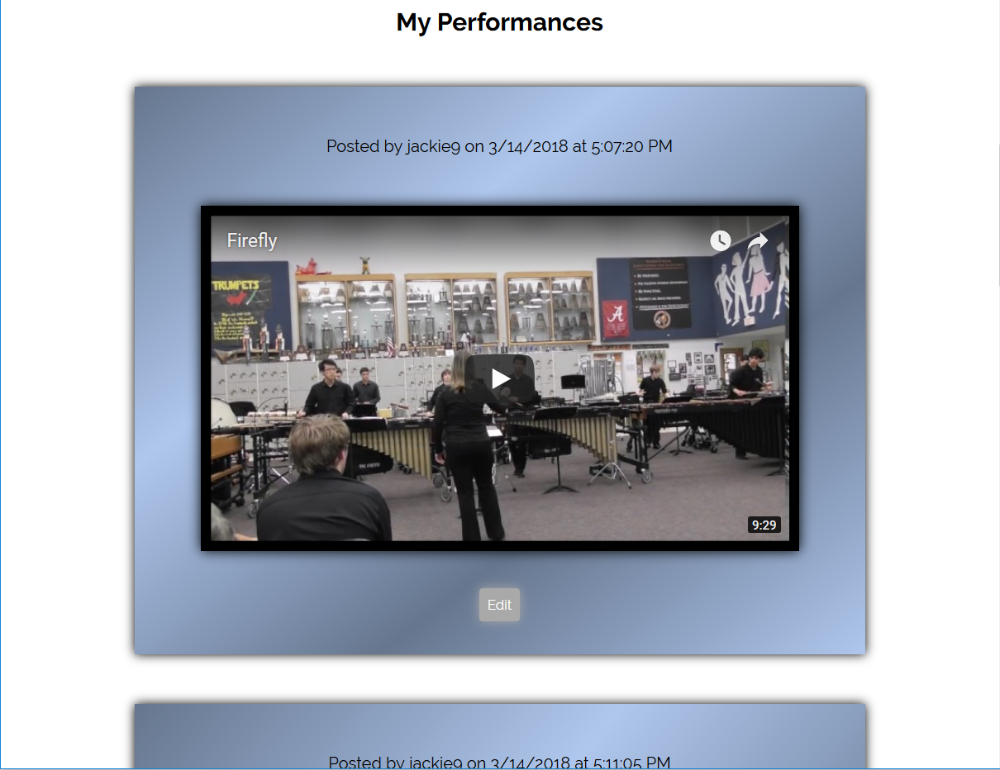
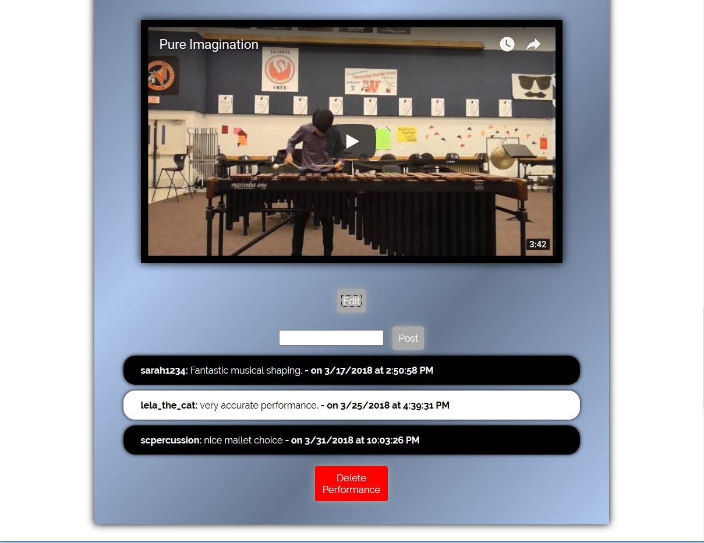
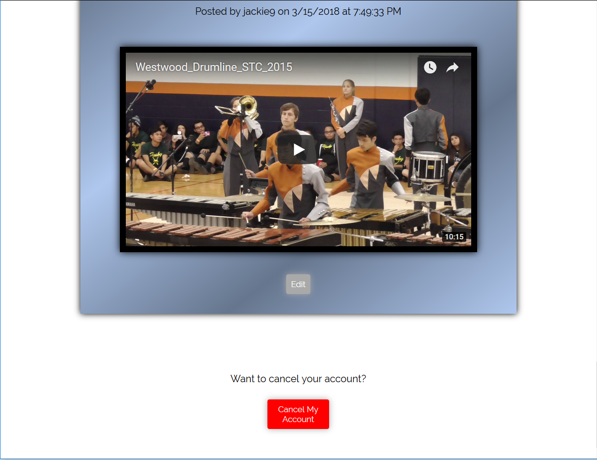
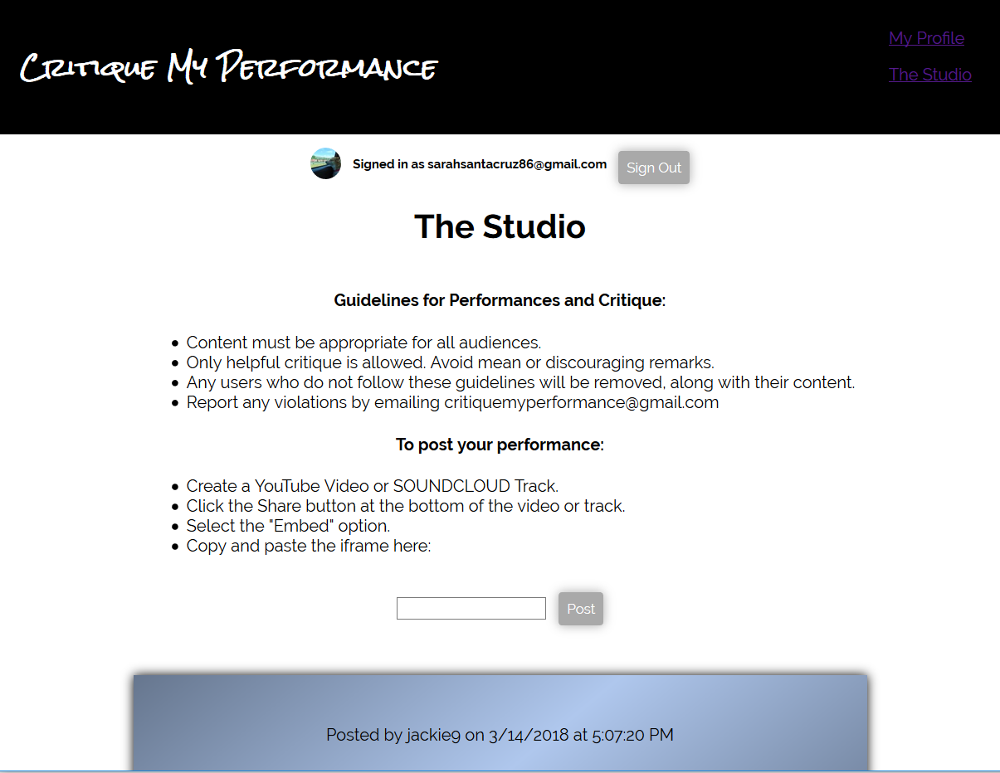
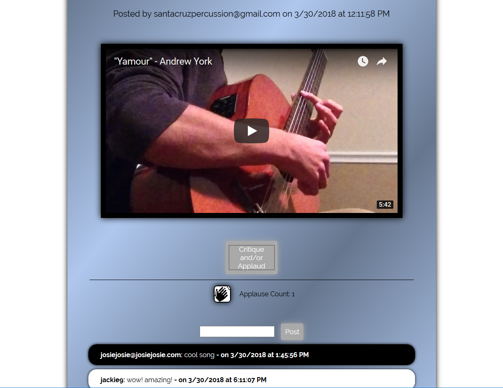

## Critique My Performance

#### Critique My Performance is a web application for musicians built using React and Firebase. Members can post YouTube or SoundCloud iframes of musical performances or practice sessions and receive critique from other members.

[Here is a link to the application](https://critiquemyperformance.herokuapp.com).

### Technologies used

* React
* ES6
* Firebase

### Explanation

Critique My Performance is my capstone project for Bloc. For this project, I was able to create anything I wanted, using any technologies I wanted to. Since I am a musician, I decided to create an application that had something to do with music. After weighing a few different options, I decided on a music critique app.  

In the application, users must create an account to access The Studio and Profile pages. The authentication is handled through Firebase.  Once a user has created an account, they are able to add a photo using Gravatar, add a username, and post video or audio performances using the YouTube or SoundCloud embed option. All users' performances are posted in The Studio, and users are able to add critique to each performance.

### Problem

The first problem I had was learning how to use Firebase Authentication.

### Solution

While there is quite a bit of documentation available for Firebase Authentication, I was unfamiliar with it when starting the project, and it took some time to figure out how to add and change users' information. Between the documentation and a few YouTube tutorials, I was able to get functional authentication in place.

### Problem

Another problem I ran into when creating the application was getting all of the performances to display every time on the studio page. When first visiting the studio page, only the last performance would show up, until refreshing the page, and then all the performances showed up.

### Solution

I changed how my application was grabbing the information from the firebase database in the `componentDidMount()` method. I was originally doing the following:

    componentDidMount() {
      this.iframesRef.on('child_added', snapshot => {
      const iframe = snapshot.val();
      iframe.key = snapshot.key;
      this.setState({ iframes: this.state.iframes.concat( iframe ) });
    });

and I changed it to this, which did the trick:

    this.iframesRef.on('child_added', snapshot => {
      const iframe = snapshot.val();
      iframe.key = snapshot.key;
      let frames = this.state.iframes;
      frames.push(iframe);
      this.setState({ iframes: frames });
    });

### Problem

How to add critique and applause to specific performances.

### Solution

I considered a couple of different options - #1) Add critique/applause to each performance object in the firebase database, or #2) Add a separate critique and separate applause object that would store all critique and applause. I decided to go with #2. There is a critique object in the database that stores all of the critiques, and each of the critiques stores the unique id for the performance it belongs to. The same concept is used for applause given to a performance.

### Problem

This error:
    Error parsing header X-XSS-Protection: 1; mode=block; report=https://www.google.com/appserve/security-bugs/log/youtube: insecure reporting URL for secure page at character position 22. The default protections will be applied.

### Solution

After researching this error, all of the information I could find indicated that this was a Chrome specific bug that is being worked on. From what I can tell, there isn't anything I can do to fix it. 

### Results

Overall, I am happy with how the application turned out. There are still a few more features I would like to add, but I think the application is something that musicians would find value in.

### Conclusion

Going through the process of designing, planning, and building an entire web application on my own has given me confidence that I am able to create things that haven't been created before.     
